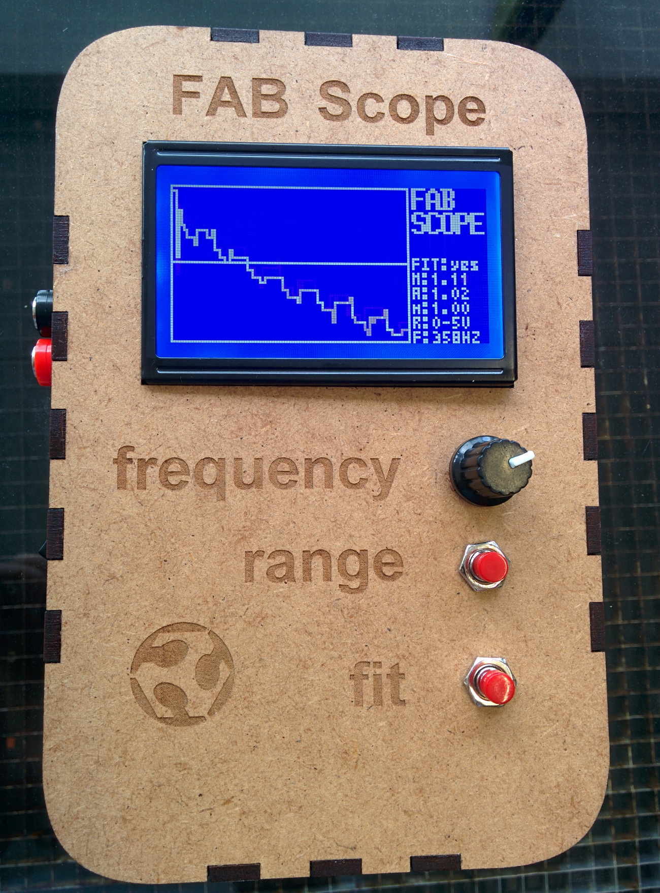
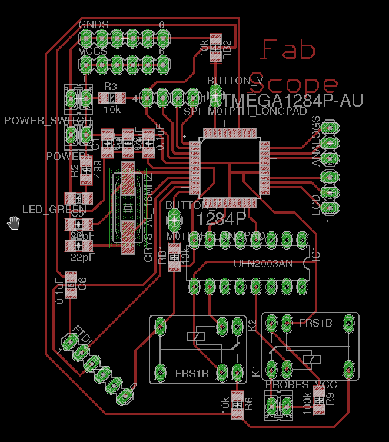
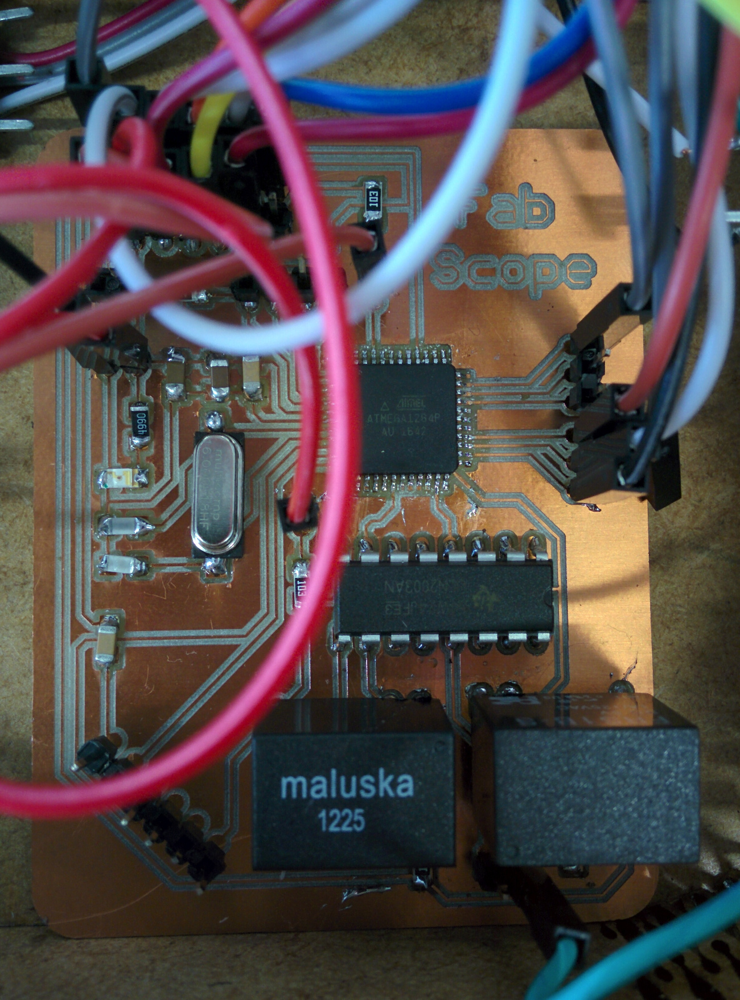
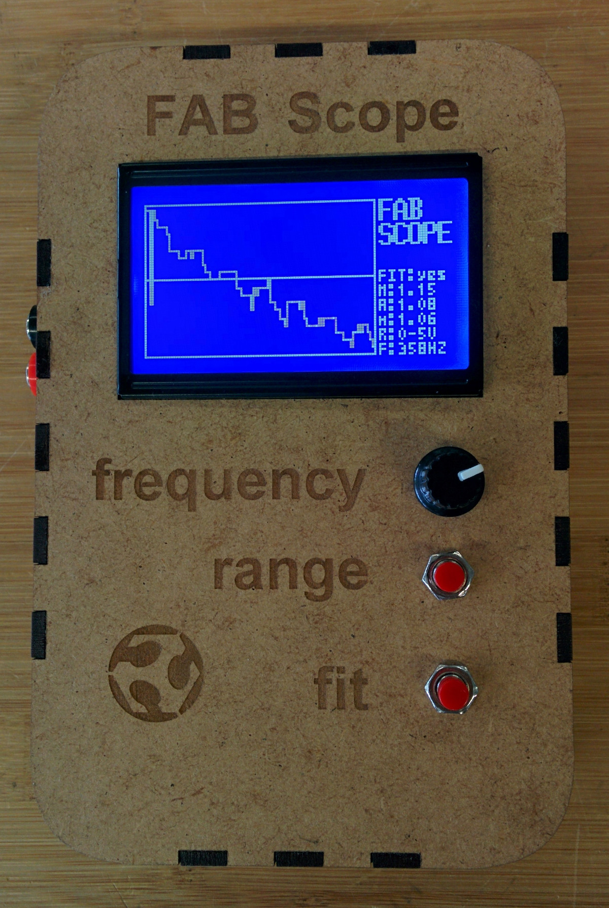
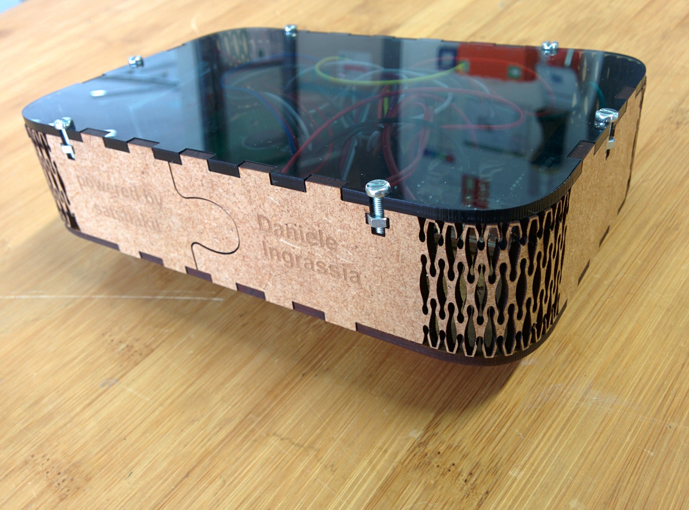
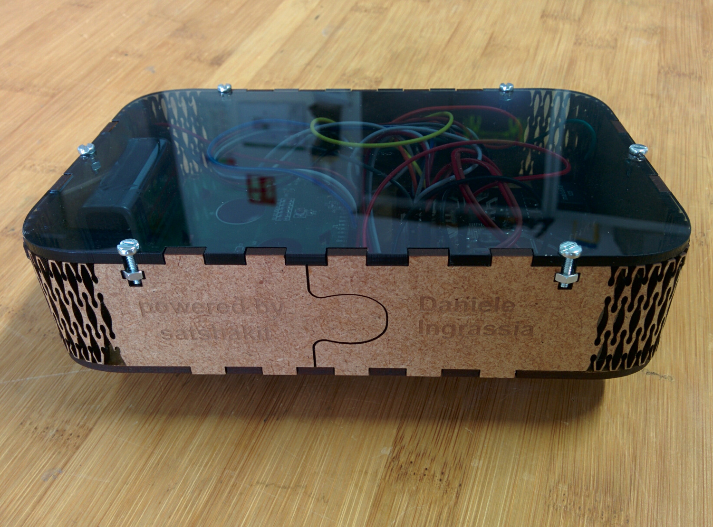
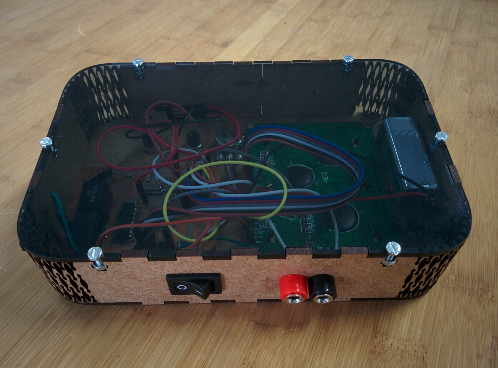

# Fab Scope

An easily fabbable and portable oscilloscope.

Features
--

- 2 voltage range supported: 0-5V, 0-50V (DC only)
- button to change the voltage ranges and fit using interrupts
- supported sampling frequency: from 100HZ to 10KHZ
- adjustable sampling frequency using a potentiometer
- 128 x 64 graphic display
- embedded high voltage relays
- on/off switch
- plug and play probes
- portable (9V battery last for more than 8 hours)
- mdf and acrylic cases
- programmable using an FTDI
- voltage measurements: max, min, average
- fit function that will zoom exactly into the current signal range

Board
--

- [Fab12 scope schematic](https://github.com/satshas/FabScope/raw/master/eagle/fab_scope.sch)
- [Fab12 scope board](https://github.com/satshas/FabScope/raw/master/eagle/fab_scope.brd)
- [Fab12 scope internal png](https://github.com/satshas/FabScope/raw/master/media/fab_scope_internal.png)
- [Fab12 scope cut png](https://github.com/satshas/FabScope/raw/master/media/fab_scope_cut.png)

Software
--

[download the code](https://raw.githubusercontent.com/satshas/FabScope/master/code/fab_scope/fab_scope.ino)

Media
--

Authors
--

- Daniele Ingrassia

Contact
--

- **ingrassiada@gmail.com**
- **[linkedin](http://it.linkedin.com/in/danieleingrassia)**

Thanks
--

[Fablab Kamp-Lintfort](http://fablab.hochschule-rhein-waal.de/index.php/de/) 
Hochschule Rhein-Waal 
Friedrich-Heinrich-Allee 25, 47475 Kamp-Lintfort, Germany 
fablab@hochschule-rhein-waal.de

License
--
This work is licensed under the terms of Attribution-NonCommercial-ShareAlike 4.0 International ([CC BY-NC-SA 4.0](https://creativecommons.org/licenses/by-nc-sa/4.0/)).

