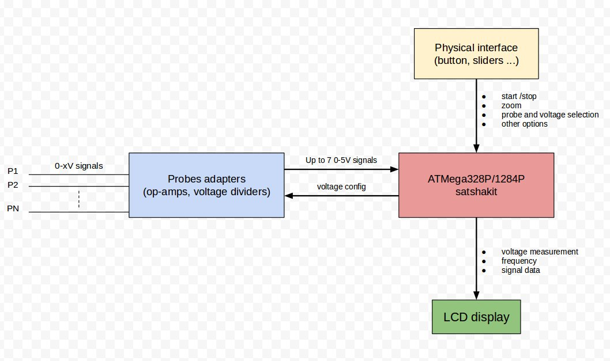
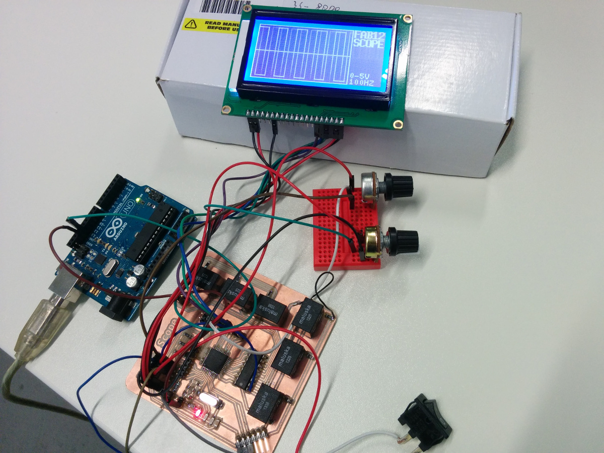

# Fab12_Oscilloscope

Design and prototype of an oscilloscope for the Fab Lab 2.0 to be built during Fab12 Shenzhen

Features
--

- multiple probes
- support multiple voltages
- adjustable zoom
- up to 10 KHZ signals

Sketch
--

satshakit based oscilloscope test:

