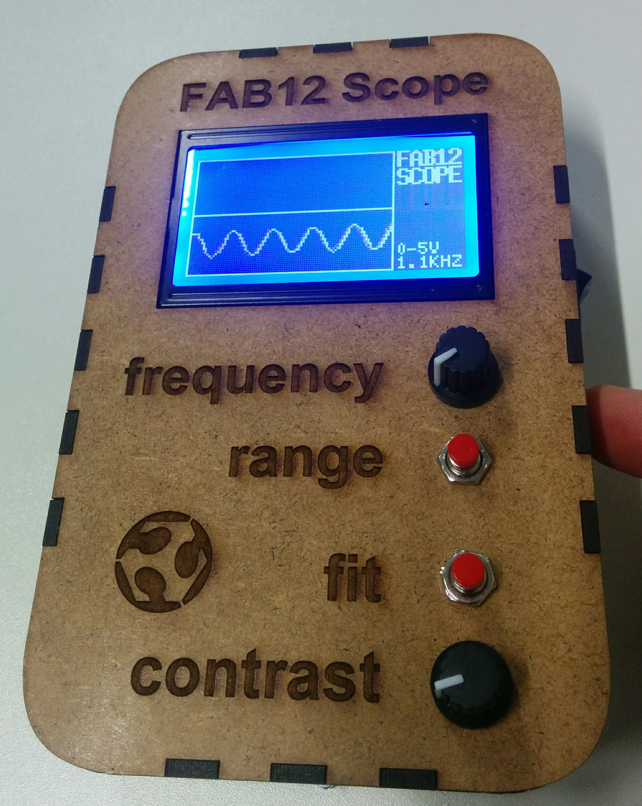
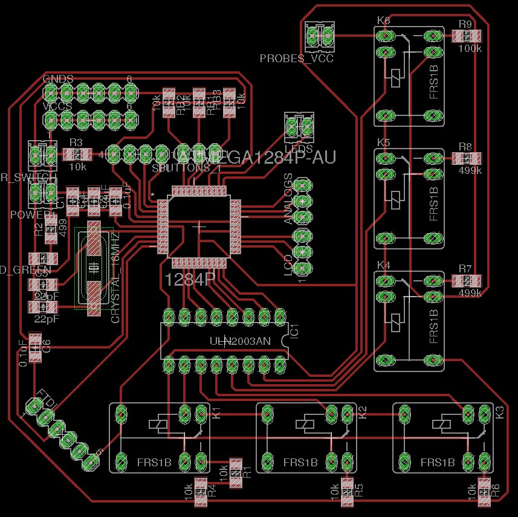
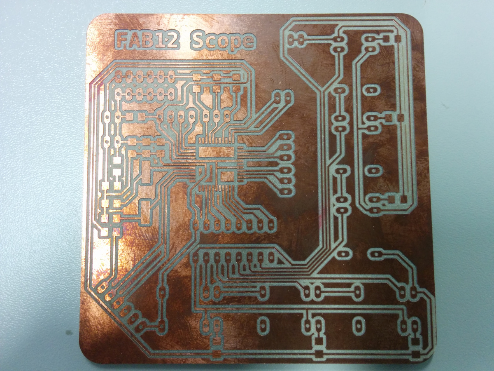
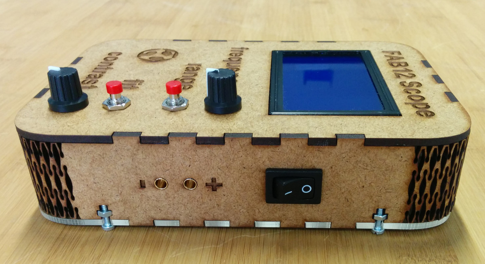
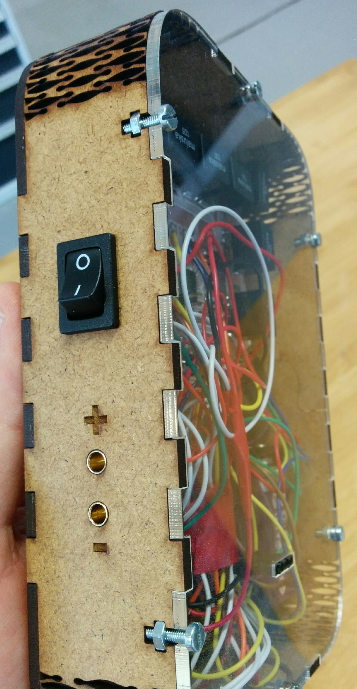
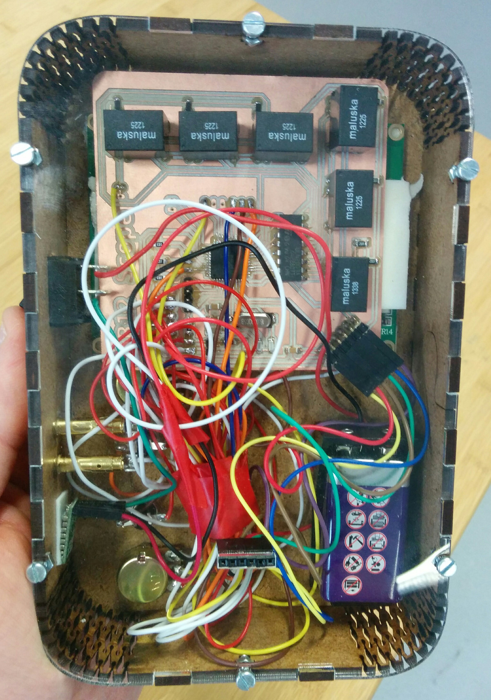
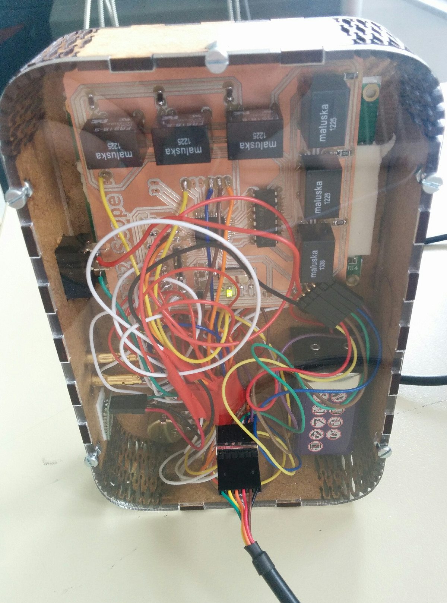
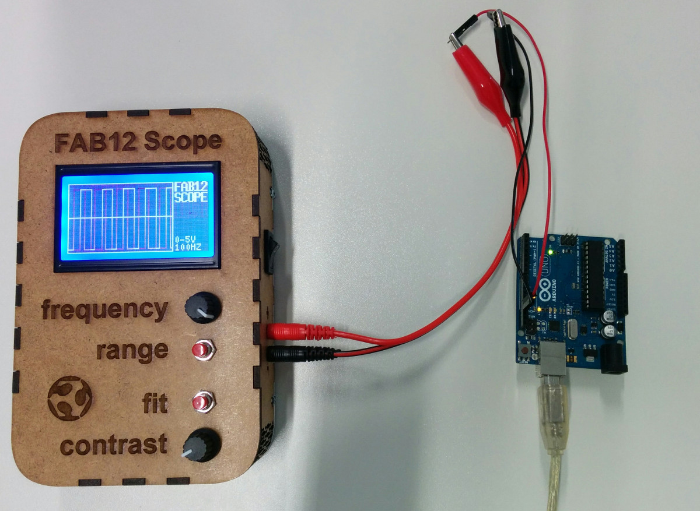
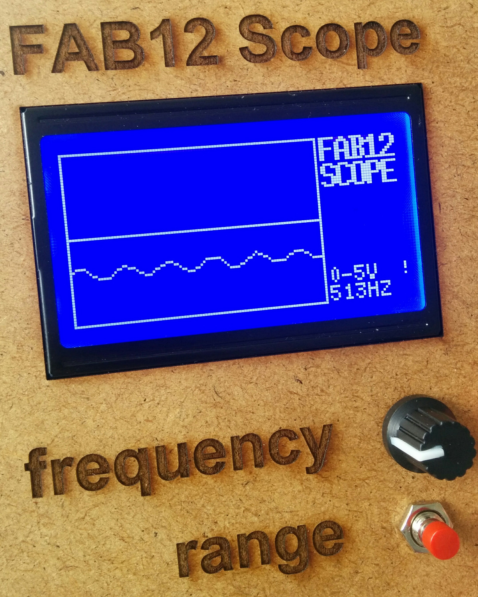

# Fab1 Scope

Design and prototype of an oscilloscope for the Fab Lab 2.0 to be built during Fab12 Shenzhen

Features
--

- 4 voltage range supported: 0-5V, 0-50V, 0-120V, 0-200V (DC only)
- button to change the voltage ranges
- supported sampling frequency: from 100HZ to 10KHZ
- adjustable sampling frequency using a potentiometer
- 128 x 64 graphic display
- embedded high voltage relays
- on/off switch
- plug and play probes
- portable (9V battery last for more than 8 hours)
- mdf and acrylic case
- programmable using an FTDI cable without opening the box

Next steps:

- voltage measurements: max, min, average
- voltage detection to auto select the proper voltage range
- add the power supply
- laser cut the case 

Board
--

- [Fab12 scope schematic](https://raw.githubusercontent.com/satshas/Fab12_Oscilloscope/master/eagle/fab12_oscilloscope.sch)
- [Fab12 scope board](https://raw.githubusercontent.com/satshas/Fab12_Oscilloscope/master/eagle/fab12_oscilloscope.brd)
- [Fab12 scope internal png](https://raw.githubusercontent.com/satshas/Fab12_Oscilloscope/master/media/fab12_oscilloscope_internal.png)
- [Fab12 scope cut png](https://raw.githubusercontent.com/satshas/Fab12_Oscilloscope/master/media/fab12_oscilloscope_cut.png)

Software
--

[download the code](https://raw.githubusercontent.com/satshas/Fab12_Oscilloscope/master/code/fab12_oscilloscope_v0.2/fab12_oscilloscope_v0.2.ino)

Media
--

first prototype:

second prototype:

third prototype: almost done!

